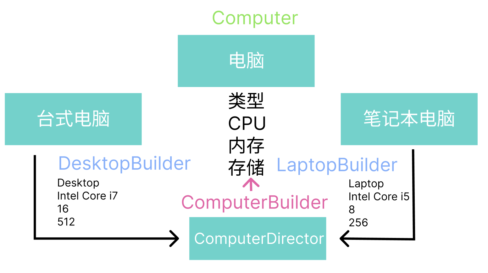

---
nav:
  title: 设计模式
  order: 1
---

# Factory

## 创建对象的设计模式

创建型设计模式是一类专注于对象的创建和实例化的设计模式。以下是一些常见的创建型设计模式：

### 1. 工厂方法模式（Factory Method Pattern）

- 描述：定义一个**接口**，让子类决定实例化哪个类，把类的实例化延迟到其子类。
- 应用场景：**当一个类无法预知他必须要创建的对象的类时**，或者它希望由子类指定创建对象时使用。
- 代码实现：

```jsx
import { Button, Space, message } from 'antd';
import { DogFactory, CatFactory } from './factory-method';

export default function Factory() {
  const speak = (type) => {
    let Factory = type === 'dog' ? DogFactory : CatFactory;
    message.success(new Factory().createAnimal().speak());
  };

  return (
    <Space>
      <Button onClick={() => speak('dog')}>🐶 My Dog</Button>
      <Button onClick={() => speak('cat')}>🐱 My Cat</Button>
    </Space>
  );
}
```

### 2.抽象工厂模式（Abstract Factory Method）

- 描述：提供一个接口，创建一系列有相关或相互依赖的对象，而不需要指定他们具体的类。
- 应用场景：**关注一组对象的创建**，
  - 创建支持多个操作系统(Win/Mac)的用户界面库；
  - 创建一套组件工厂，可以切换使用哪套组件库渲染；
- 代码实现：

```jsx
import { Space, Button, message } from 'antd';
import { createUI, MacFactory, WinFactory } from './abstract.ts';

const macUI = createUI(new MacFactory());
const winUI = createUI(new WinFactory());

export default function AbstractFactory() {
  return (
    <Space>
      <Button onClick={() => message.success(macUI.button.paint())}>
        💻 Mac Button
      </Button>
      <Button onClick={() => message.success(winUI.checkbox.paint())}>
        🖥 Win Checkbox
      </Button>
    </Space>
  );
}
```

生成不同组件库的按钮

```jsx
import {
  LibFactory,
  NextFactory,
  AntdFactory,
  createLib,
} from './abstract-antd-next';
import '@alifd/next/dist/next.css';
const Antd = createLib(new AntdFactory());
const Next = createLib(new NextFactory());

export default function App() {
  return (
    <div style={{ gap: '8px' }}>
      <Antd.button type="dashed">Antd Dashed</Antd.button>
      <Next.button type="secondary">Fusion Next</Next.button>
    </div>
  );
}
```

### 3. 建造者模式（Builder Pattern）

- 描述：构建与表现分离，**使用同样的构建过程创建不同的对象**, 或者 **通过不同的步骤创建不同的对象**。
- 应用场景：构建步骤多，灵活选择构建步骤。感觉像是代工厂给你提供了一系列的流水线，你可以自由组装和定制各流水线。
  
- 代码实现：

```jsx
import { useState } from 'react';
import { Space, Button } from 'antd';
import { DesktopBuilder, LaptopBuilder, ComputerDirector } from './builder';

const desktopBuilder = new DesktopBuilder();
const laptopBuilder = new LaptopBuilder();
const computerDirector = new ComputerDirector();

export default function App() {
  const [desktops, setDesktops] = useState([]);
  const [laptops, setLaptops] = useState([]);

  const createDesktop = () => {
    const desktopBuilder = new DesktopBuilder();
    computerDirector.construct(desktopBuilder);
    setDesktops((prev) => [...prev, desktopBuilder.getComputer()]);
  };

  const createLaptop = () => {
    const laptopBuilder = new LaptopBuilder();
    computerDirector.construct(laptopBuilder);
    setLaptops((prev) => [...prev, laptopBuilder.getComputer()]);
  };
  return (
    <div>
      <p>Desktop:</p>
      <ul>
        {desktops.map((item, idx) => (
          <li key={idx}>{item.display()}</li>
        ))}
      </ul>
      <p>Laptop:</p>
      <ul>
        {laptops.map((item, idx) => (
          <li key={idx}>{item.display()}</li>
        ))}
      </ul>
      <Space>
        <Button onClick={createDesktop}>创建 Desktop</Button>
        <Button onClick={createLaptop}>创建 Laptop</Button>
      </Space>
    </div>
  );
}
```
